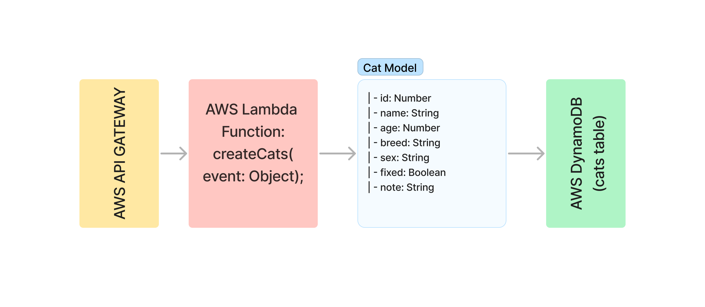

# Cat Management API

A serverless Cat Management API built using AWS API Gateway, Lambda, and DynamoDB.

## UML

## Overview

This Cat Management API allows users to perform CRUD operations on cat records. Each record consists of the following attributes: `id`, `age`, `breed`, `fixed`, `name`, `note`, and `sex`.

## Architecture

- **API Gateway**: Exposes the RESTful API for managing cat records.
- **Lambda**: Handles the business logic for processing requests and interacting with the DynamoDB table.
- **DynamoDB**: Stores the cat records.

## Endpoints

### List all cats

- **URL**: `/cats`
- **Method**: `GET`

### Create a new cat

- **URL**: `/cats`
- **Method**: `POST`
- **Data**: 
{
"id": 1,
"age": 2,
"breed": "Burmese",
"fixed": true,
"name": "Tacos",
"note": "happy",
"sex": "Female"
}

markdown
Copy code

### Get a specific cat by ID

- **URL**: `/cats/{id}`
- **Method**: `GET`
- **URL Parameters**: `id=[integer]`

### Update a specific cat by ID

- **URL**: `/cats/{id}`
- **Method**: `PUT`
- **URL Parameters**: `id=[integer]`
- **Data**: 
{
"age": 3,
"breed": "Burmese",
"fixed": true,
"name": "Tacos",
"note": "happy",
"sex": "Female"
}

markdown
Copy code

### Delete a specific cat by ID

- **URL**: `/cats/{id}`
- **Method**: `DELETE`
- **URL Parameters**: `id=[integer]`

## Deployment

This application can be deployed using the AWS Management Console, AWS CLI, or AWS CloudFormation.

### Prerequisites

- AWS account with appropriate permissions
- Node.js installed locally
- AWS CLI configured with your AWS credentials

### Deployment Steps

1. Create a new DynamoDB table named `Cats` with a primary key `id` of type `Number`.
2. Zip your Lambda function code including `node_modules` and `package.json`.
3. Create a new Lambda function and upload the zipped package. Set the runtime to `Node.js`.
4. Add an environment variable `CATS_TABLE` with the value `Cats` to your Lambda function.
5. Grant the necessary IAM permissions to the Lambda function for interacting with DynamoDB.
6. Create a new API Gateway REST API and configure resources and methods for the API.
7. Deploy the API to a stage (e.g., `prod` or `test`).
8. Test the API using tools like Postman or curl.

## License